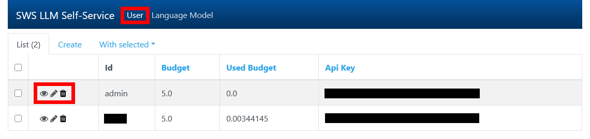

# SWS LLM Self-Service - Admin Interface

## OpenAI Proxy

Um das Admin Interface zu erreichen, rufen Sie https://service.scadsai.uni-leipzig.de/sws-llm-proxy/ auf und melden sich mit dem Admin Account an.

### Startseite

Auf der Startseite finden Sie die Admin Accountübersicht. Hier sind Ihr API-Key, Ihr Budget sowie alle, über den Proxy-Server verfügbaren OpenAI-Modelle und deren Pricing zu sehen.


Die Dokumentation zur Nutzung des Proxy-Servers finden Sie [hier](<OpenAI Proxy - User Guide.md>).

### User

In dem `User`-Tab finden Sie eine Liste aller registrierten Nutzenden des Proxy-Servers. In dieser Liste finden Sie außerdem das Budget und die API-Keys aller Nutzenden. Durch Anklicken der Überschriften der Tabelle können Sie die Einträge jeweils auf- oder absteigend sortieren.


Hier können Sie auch zu jedem Nutzenden eine Detail-Ansicht aufrufen, jeden Account bearbeiten oder auch löschen:



Um mehrere Accounts gleichzeitig zu löschen, wählen Sie die jeweiligen Accounts aus und löschen Sie diese über `With selected`>>`Delete`:


In dem `User`-Tab können Sie außerdem neue Accounts anlegen:


### Language Model

In dem `Language Model`-Tab finden Sie eine Liste aller aktuell verfügbaren und über den Proxy-Server nutzbaren Sprachmodelle sowie deren exakter Snapshot-Name, Encoding Modell und Pricing. Die Einträge können Sie ebenfalls durch anklicken der Überschriften auf- und absteigend sortieren.


Hier können Sie auch zu jedem Eintrag Deteils einsehen, diesen bearbeiten und auch löschen:


Die Löschung mehrere Sprachmodelle auf einmal ist ebenfalls möglich:


In dem `Language Model`-Tab können Sie auch weitere Language-Models einpflegen. Provider ist hierbei immer `openai`.


> Die, bei OpenAI verfügbaren Sprachmodelle, deren Snapshot-Bezeichnungen sowie deren Pricing finden Sie unter https://platform.openai.com/docs/models.

Um das Encoding Modell in Erfahrung zu bringen, sofern dieses nicht angegeben ist, können Sie diesen Code ausführen:

```python
import tiktoken

print(tiktoken.encoding_for_model('gpt-4o-2024-11-20'))
```

Setzen Sie jeweils den Model-Snapshot ein, dessen Encoding Model Sie suchen und achten Sie darauf, dass ihre installierte `tiktoken` Library auf dem aktuellsten Stand ist.
